# Question 1

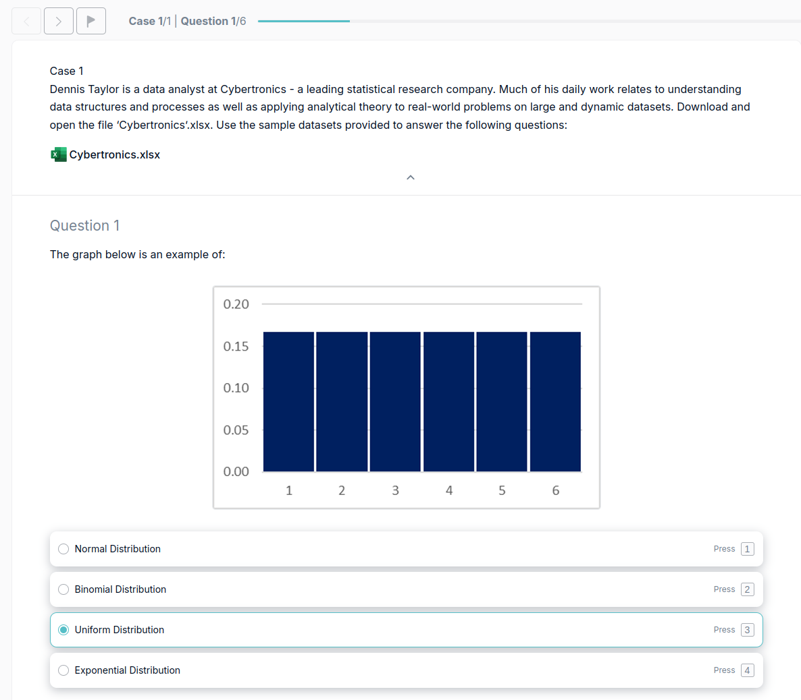

## Explanation
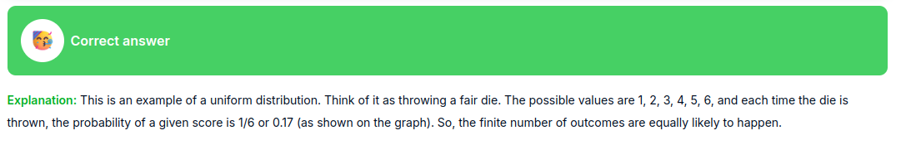
# Question 2
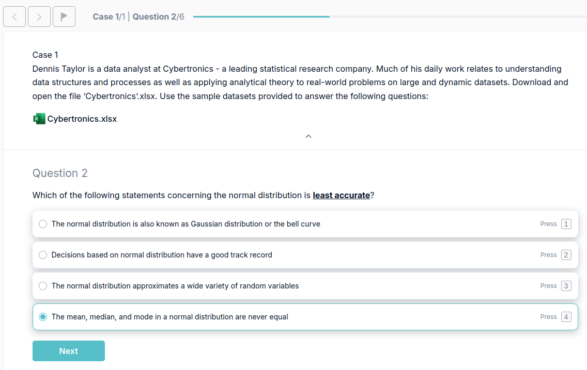

Explanation

![[2A.png]]

# Question 3
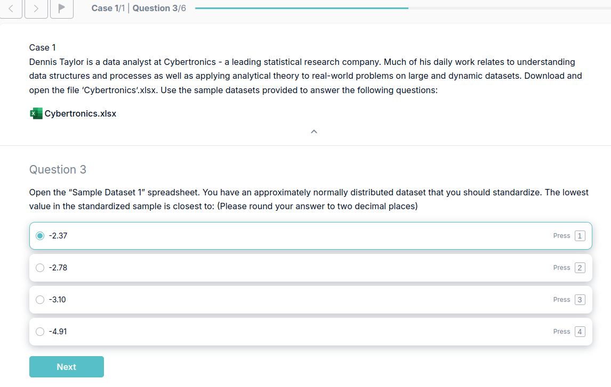

## Explanation
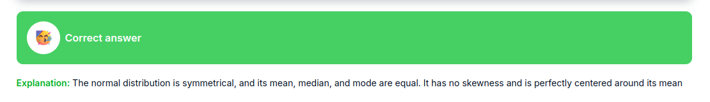

# Question 4
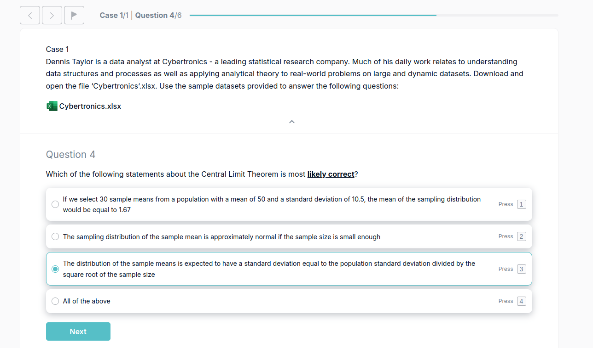

## Explanation
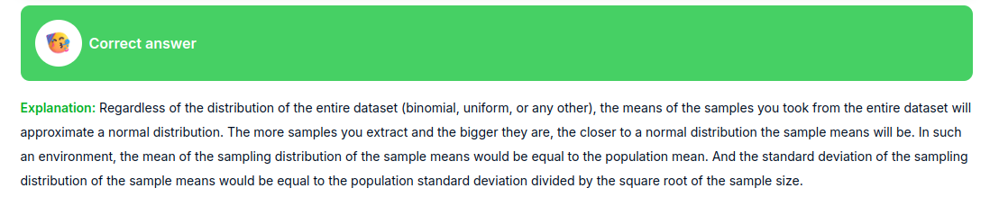

# Question 5

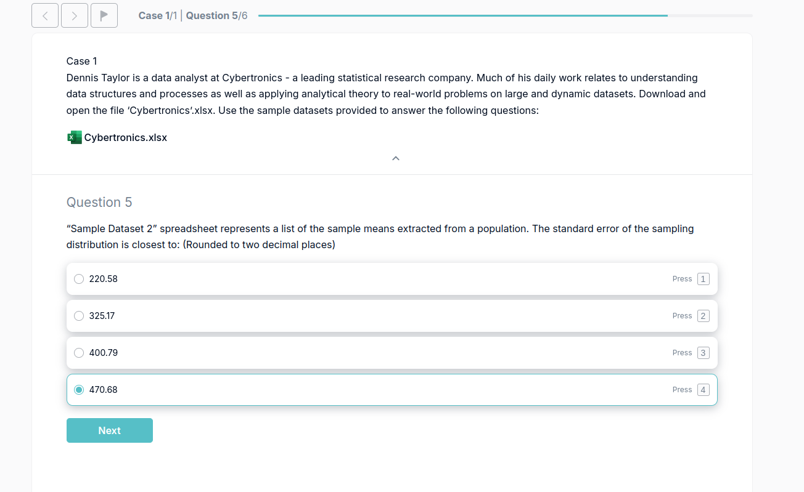

## Explanation
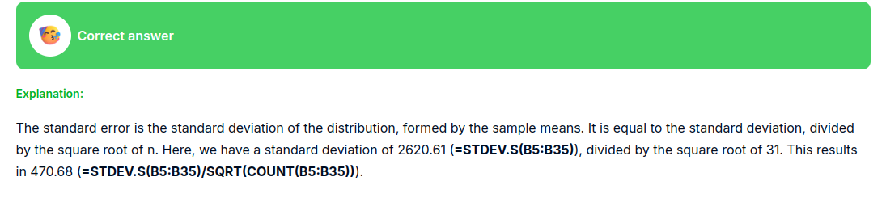

# Question 6
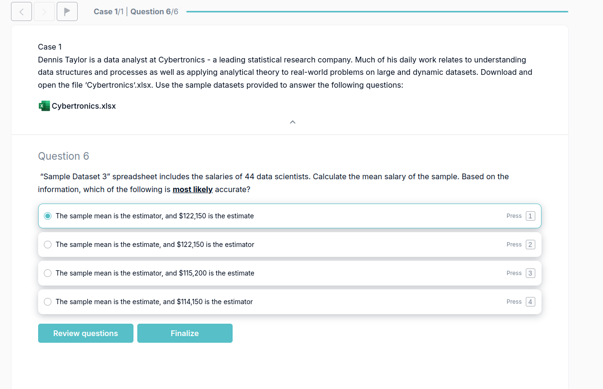

## Explanation

# Exam

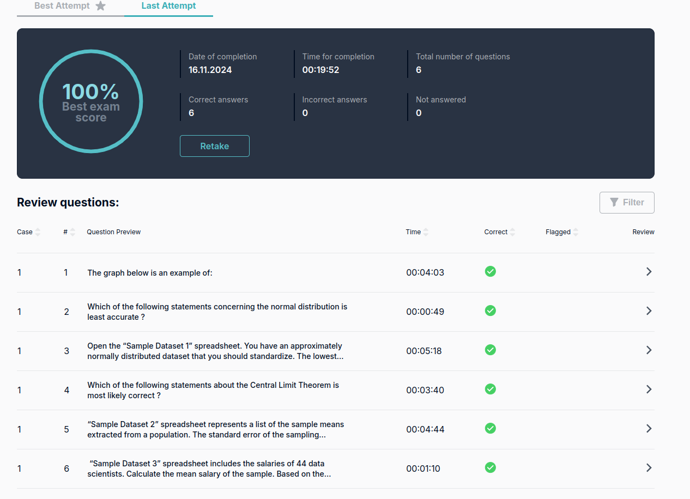