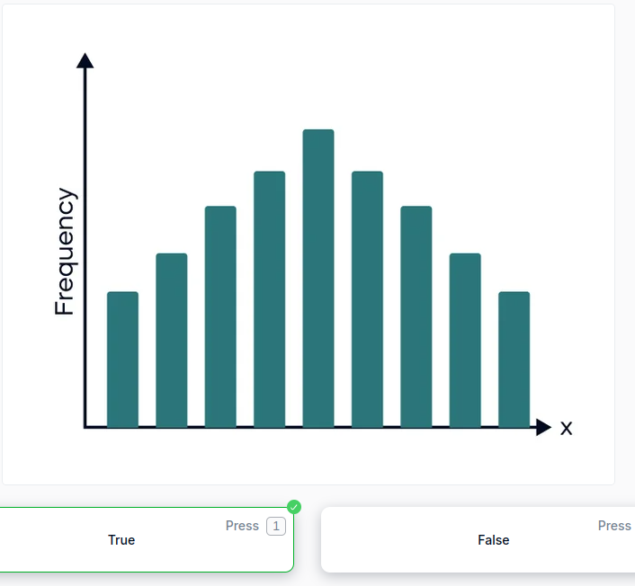
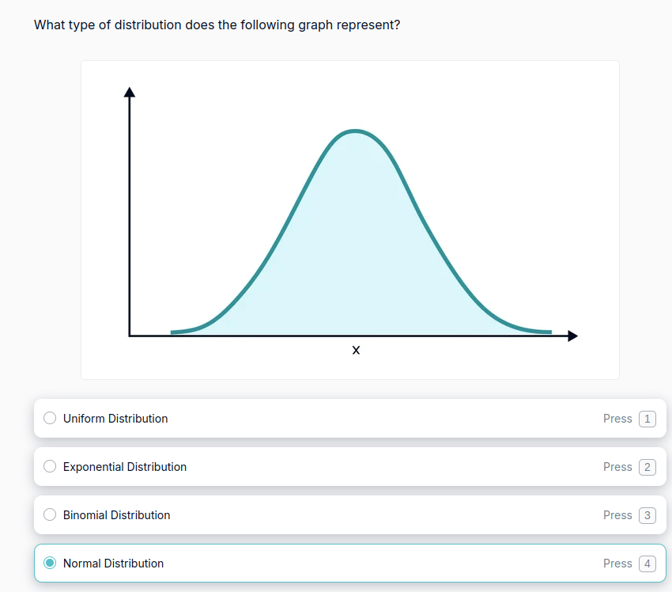
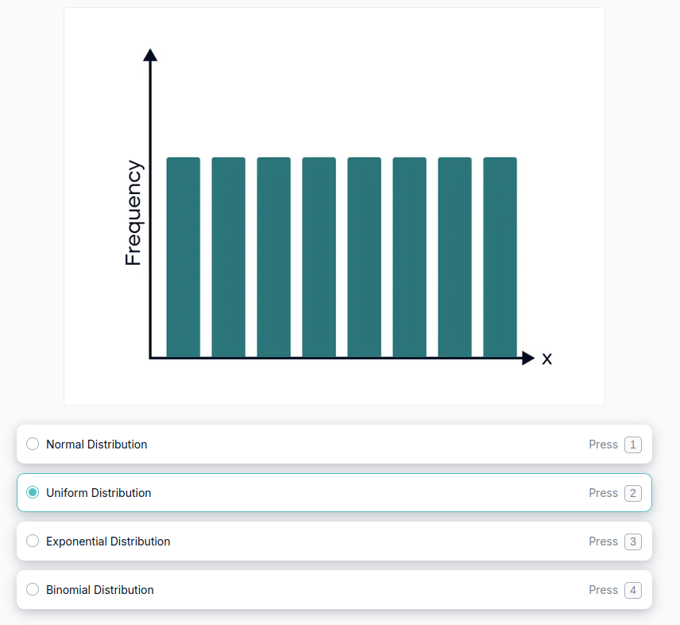
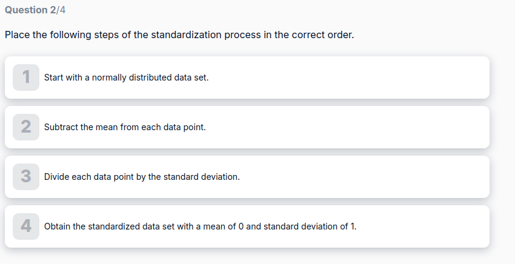
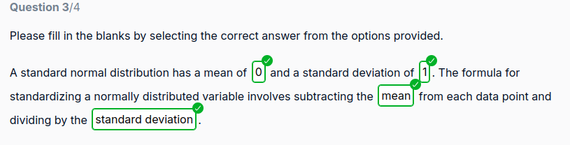
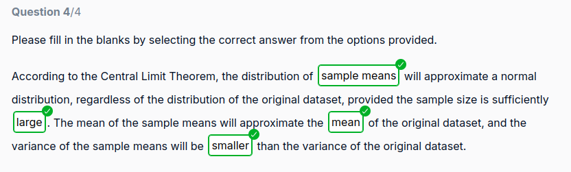
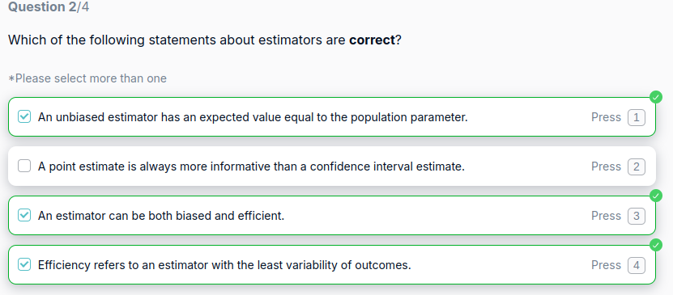
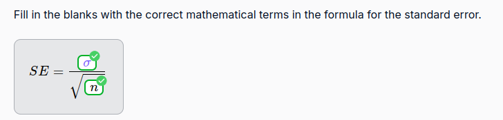
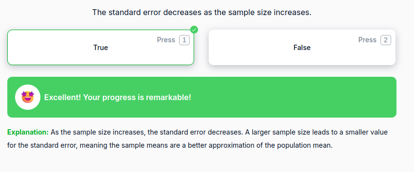
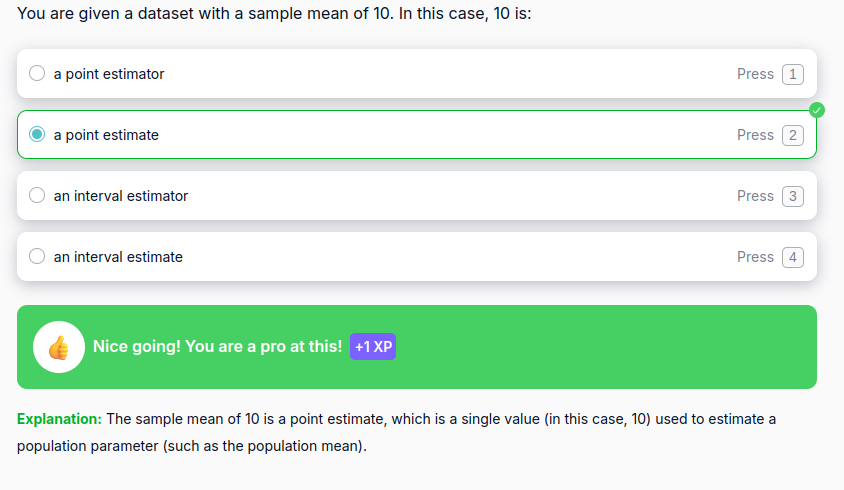

## Question 1
**Complete the statements about probability distributions by filling in the blanks with the correct terms.**

A distribution is a **function** that shows the possible values for a variable and how often they occur. The Uniform distribution is an example of a distribution where all outcomes are **equally** likely. The sum of all probabilities in a probability distribution must equal **1**. A continuous distribution differs from a discrete distribution in that it deals with variables that can take on an **infinite** number of values within a given range.

## Question 2
The following graph is an example of Binomial Distribution:

 

Explanation: 
A **binomial distribution** is a discrete probability distribution that describes the number of successes in a fixed number of independent trials, each with the same probability of success. It models the outcomes of experiments where there are only two possible outcomes: success or failure. It’s commonly used to represent scenarios like flipping a coin, answering true/false questions, or determining pass/fail results.

## Question 3
**What type of distribution does the following graph represent?**

 

**Explanation:** 
A **normal distribution**, also known as a **Gaussian distribution**, is a continuous probability distribution that is symmetrical and bell-shaped. It is one of the most important probability distributions in statistics because many real-world phenomena tend to follow this distribution when the sample size is large.

## Question 4
**What type of distribution does the following graph represent?**
 

Explanation: 
A **uniform distribution** is a type of probability distribution in which all outcomes are equally likely. It is called "uniform" because each value in a given range has the same probability of occurring. There are two types of uniform distributions: **discrete** and **continuous**.

## Question 5
**Choose the INCORRECT answer. A Normal distribution is one of the most commonly used distribution types, because:**

* **All variables can be represented by the Normal distribution (Incorrect answer).**
* Distributions of sample means with large enough sample sizes could be approximated to Normal.
* Computable statistics are elegant.
* Decisions based on Normal distribution insights have a good track record.

**Explanation:** 
Not all variables can be represented by a Normal distribution. Many variables follow different distributions (e.g., uniform, exponential, binomial, etc.) and do not necessarily fit the bell curve of the Normal distribution. While the Normal distribution is widely used, it is only appropriate for certain types of data, particularly those that are continuous and symmetrically distributed around a mean. The other statements are correct and describe why the Normal distribution is popular in statistics.
## Question 6

**Choose the INCORRECT answer about the central limit theorem.**

* The means of the samples we extract will be closer to normally distributed if we extract more samples.
* The distribution of the sample means is expected to have a mean equal to the mean of the original dataset.
* The distribution of the sample means is expected to have a variance equal to the variance of the original dataset, divided by the sample size.
* **The means of the samples we extract will be closer to normally distributed, the smaller the samples we extract.**

**Explanation:** 
According to the **Central Limit Theorem**, the means of the samples will approximate a normal distribution **as the sample size increases**. Larger samples provide a better approximation of the normal distribution. *Small sample sizes may not approximate a normal distribution as well, which is why larger samples are preferred for better results.*

## Question 7

**Place the following steps of the standardization process in the correct order.**
 

## Question 8
**Please fill in the blanks by selecting the correct answer from the options provided.**

A standard normal distribution has a mean of 0 and a standard deviation of 1. The formula for standardizing a normally distributed variable involves subtracting the mean from each data point and dividing by the standard deviation.

 
## Question 9
**Please fill in the blanks by selecting the correct answer from the options provided.**

According to the Central Limit Theorem, the distribution of  sample means will approximate a normal distribution, regardless of the distribution of the original dataset, provided the sample size is sufficiently large. The mean of the sample means will approximate the mean of the original dataset, and the variance of the sample means will be smaller  than the variance of the original dataset.

 

## Question 10

**A point estimate of a population parameter, such as the sample mean, always has to be unbiased.**

* FALSE

**Explanation:** 
While an unbiased estimator is desirable (i.e., an estimator whose expected value equals the true population parameter), not all point estimates are necessarily unbiased. Some estimators may be biased but are still useful in practice due to other properties, such as lower variance or computational convenience. For example, certain estimators may systematically overestimate or underestimate the true parameter but can still be used in specific contexts.

## Question 11

**Which of the following statements about estimators are correct?**

 

**Explanation:** 

* An unbiased estimator has an expected value equal to the population parameter – This is correct. An unbiased estimator's expected value equals the true population parameter, meaning it does not systematically overestimate or underestimate the parameter.  

* A point estimate is always more informative than a confidence interval estimate – This is incorrect. A confidence interval provides a range of plausible values for the population parameter along with a level of confidence, often making it more informative than a single point estimate, which provides no measure of uncertainty.  

* An estimator can be both biased and efficient – This is correct. An estimator can be biased (not centering around the true parameter) but still be efficient (having low variance), meaning its estimates are consistently close to each other, even if they are not centered on the true value.  

* Efficiency refers to an estimator with the least variability of outcomes – This is correct. Efficiency refers to an estimator that has the smallest variance among all unbiased estimators, meaning it produces estimates with the least variability.

  

## Question 12
**Fill in the blanks with the correct mathematical terms in the formula for the standard error.** 

 
## Question 13

**The standard error decreases as the sample size increases.**

 

**Explanation:** 
As the sample size increases, the standard error decreases. A larger sample size leads to a smaller value for the standard error, meaning the sample means are a better approximation of the population mean.

## Question 14

You are given a dataset with a sample mean of 10. In this case, 10 is:

 

## Question 15