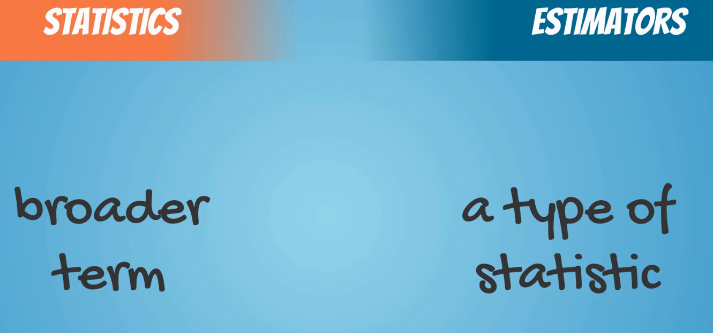

## Introduction

Inferential statistics refers to methods that rely on probability theory and distribution, in particular, to predict population values based on sample data.

But why this definition might not be completely clear just yet.

## What is a distribution?
Before we can talk about testing we have to learn what a distribution is.
In statistics, when we talk about distributions we usually mean probability distributions. 

Definition (informal): A distribution is a function that shows the possible values for a variable and how often they occur. 

Definition (Wikipedia): In probability theory and statistics, a probability distribution is a mathematical function that, stated in simple terms, can be thought of as providing the probabilities of occurrence of different possible outcomes in an experiment. 
Examples: Normal distribution, Student’s T distribution, Poisson distribution, Uniform distribution, Binomial distribution.

### Example 1 - Rolling a die

* There is an equal chance of getting each of the 6 outcomes
* The probability is 1/6 which is equal to 0.17

| Resultado     | Probabilidad de ocurrencia |
| ------------- | -------------------------- |
| 1             | 0.17                       |
| 2             | 0.17                       |
| 3             | 0.17                       |
| 4             | 0.17                       |
| 5             | 0.17                       |
| 6             | 0.17                       |
| Todo lo demas | 0                          |
|||
|||

The distribution of an event does not consist only of input values that can be observed but is composed of all possible events.

A die has a uniform discrete distribution.

### Example 2 - Rolling 2 dies

## The Normal Distribution

The Standard Normal distribution is a particular case of the Normal distribution. It has a mean of 0 and a standard deviation of 1. Every Normal distribution can be ‘standardized’ using the standardization formula:

## Standard error
The standard error is the standard deviation of the distribution formed by the sample means

$$ standard-deviation = \sqrt{\dfrac{\sigma²}{n}}  $$

## Estimators and Estimates

Estimator of a population parameter
* Is and approximation depending solely on sample information

An specific value is called an "Estimate"

There are two types of estimates

* Point estimates
  * A single number
* Confidence intervals estimates
  * A interval

Two are closely related

### Estimator
Broadly, an estimator is a mathematical function that approximates a population parameter depending only on sample information. Examples of estimators and the corresponding parameters:

| Term        | Estimator | Parameter     |
| ----------- | --------- | ------------- |
| Mean        | $$ x $$   | $$ \pi $$     |
| Variance    | $$ s²$$   | $$ \sigma² $$ |
| Correlation | $$ r $$   | $$ \rho $$    |

#### **Estimators have two important properties:** 

##### **Bias** 
The expected value of an unbiased estimator is the population parameter. The bias in this case is 0. If the expected value of an estimator is (parameter + b), then the bias is b.

##### **Efficiency** 

The most efficient estimator is the one with the smallest variance

 

### Estimates
An estimate is the output that you get from the estimator (when you apply the formula). There are two types of estimates:

* Point estimates
	* A single value. 
	* Examples: 
		* 1 
		* 5
		* 122.67
		* 0.32
* Confidence interval estimate
	* An interval. 
	* Examples:
		* ( 1 , 5 )
		* ( 12 , 33)
		* ( 221.78 , 745.66)
		* ( - 0.71 , 0.11 )

A point estimates is inside a confidence interval. 
Confidence intervals are much more precise than point estimates. That is why they are preferred when making inferences.

### Estimators & Statistics

The word "statistic" is a broader term. A point estimator is a type of a statistic.

